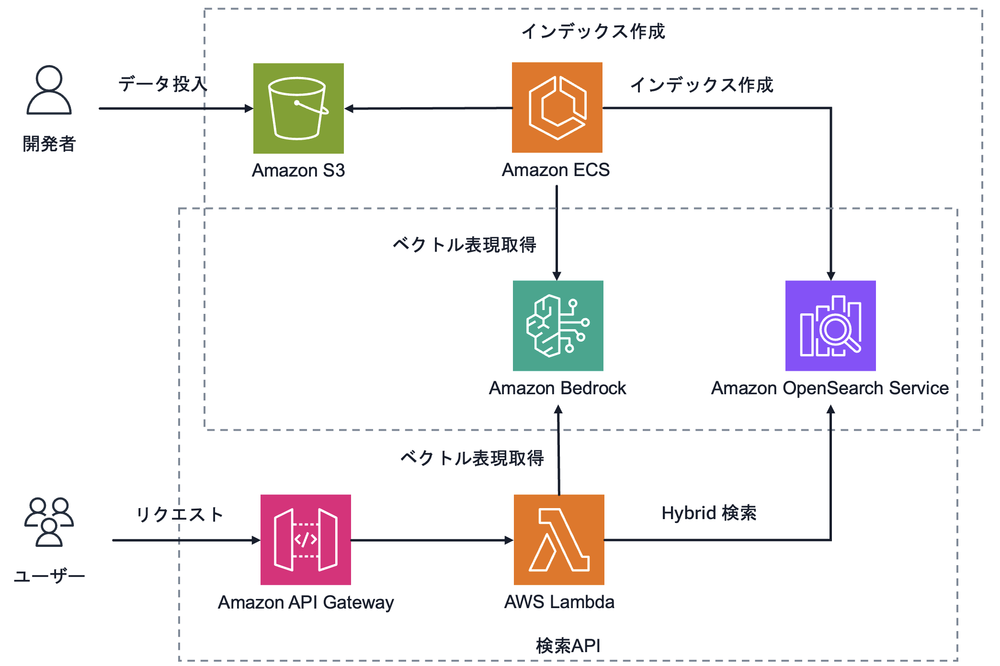
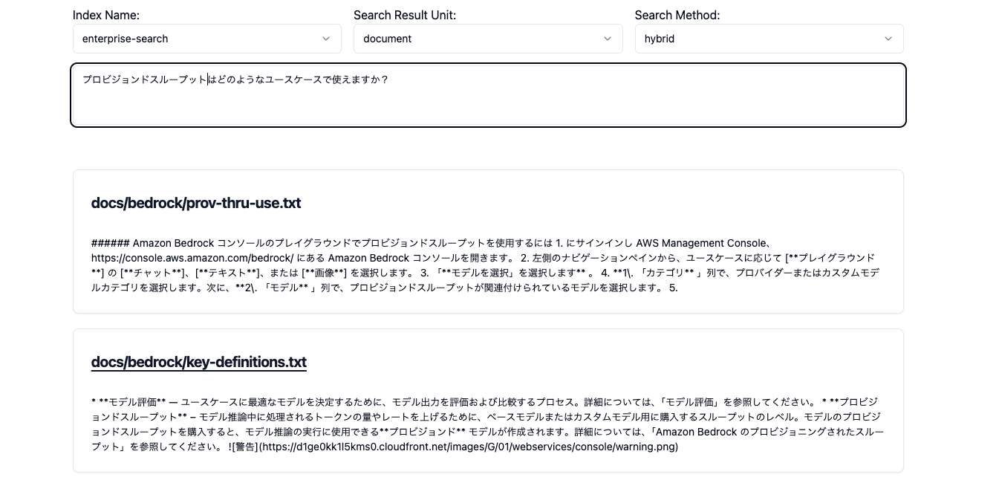

# opensearch-intelligent-search-jp

opensearch-intelligent-search-jp は、生成 AI を活用した日本語検索システムを自ら構築・チューニングしたい開発者の方に向けて、OpenSearch でのベースとなるサンプル実装をCDKで提供するリポジトリです。

このリポジトリをデプロイすると、サンプルシナリオとして用意されている AWS サービスのドキュメント (SageMaker, Bedrock, Kendra の開発者ガイド) の検索システムを構築します。
このサンプル実装には、以下のような要素が含まれます。

- OpenSearch による日本語 Hybrid 検索 (= 全文検索とベクトル検索を組み合わせた検索)
  - 全文検索のアナライザーとして、[Sudachi プラグイン](https://github.com/WorksApplications/elasticsearch-sudachi)を利用
  - ベクトル検索用の Embedding 作成には、Amazon Bedrock 上のモデルを利用。
    - [Titan Text Embedding v2](https://docs.aws.amazon.com/bedrock/latest/userguide/titan-embedding-models.html)

目次

- [Generative AI Japanese Search](#generative-ai-japanese-search)
  - [アーキテクチャ](#アーキテクチャ)
  - [デプロイ](#デプロイ)
    - [前提条件](#前提条件)
    - [デモアプリのデプロイ](#デモアプリのデプロイ)
  - [Next Steps](#next-steps)
  - [Contributing](#contributing)
  - [License](#license)

## アーキテクチャ



## デプロイ

リポジトリに付属する評価用のデータを用いたデモアプリケーションをデプロイする手順を説明します。

### 前提条件

- CDK アプリケーションをデプロイできる環境。
  - 詳細は CDK の[開発者ガイド](https://docs.aws.amazon.com/cdk/v2/guide/getting_started.html)をご参照ください。
  - CDK アプリケーションをデプロイするためには、事前に [Bootstrap](https://docs.aws.amazon.com/cdk/v2/guide/bootstrapping.html) が必要です。
    ```
    npx -w packages/cdk cdk bootstrap
    ```
- Bedrock 上の Embedding モデルへのアクセス。
  - Bedrock のコンソールから、Titan Text Embeddings V2 へのアクセス権を取得してください (デフォルトでは、Bedrock のリージョンは `us-east-1` を使用しています)。詳細については、[Bedrock 開発者ガイド](https://docs.aws.amazon.com/bedrock/latest/userguide/model-access.html)をご参照ください。

### デモアプリのデプロイ

デモアプリをデプロイする大まかな手順は以下の通りです。

1. 設定の確認
2. AWS リソースの作成 (cdk deploy)
3. サンプルデータ投入

#### 1. 設定の確認

デモアプリの設定は、`packages/cdk/cdk.json` で指定しています。
設定可能なパラメータとその意味は以下の通りです。

|     パラメータ      |   デフォルト値    |                                               意味                                                |
| :-----------------: | :---------------: | :-----------------------------------------------------------------------------------------------: |
| opensearchIndexName | enterprise-search |                           デフォルトで使用される OpenSearch の Index 名                           |
|    bedrockRegion    |     us-east-1     |                               Bedrock のモデルを呼び出すリージョン                                |
|  selfSignUpEnabled  |       true        | Cognito のセルフサインアップの有効化の有無 (trueの場合、フロントUIからユーザー作成可能になります) |

#### 2. AWS リソースの作成 (cdk deploy)

デモアプリをデプロイするためには、リポジトリのクローン & ルートディレクトリに移動の上、以下のコマンドを実行します。

```
$ npm ci
$ npm run cdk:deploy
```

`cdk deploy` を実行すると、必要な AWS リソース (OpenSearchなど) を作成します。
実行には、30分ほどかかります。

※ [Finch](https://github.com/runfinch/finch) を使用する場合、環境変数 `CDK_DOCKER=finch` を export する必要があります。詳しくは以下をご参照ください。
https://github.com/aws/aws-cdk/tree/main/packages/cdk-assets#using-drop-in-docker-replacements

#### 3. サンプルデータ投入

次に、サンプルデータを取り込み OpenSearch のインデックスを作成します。以下の手順は、CDK のデプロイが完了してから実施してください。

OpenSearch の Domain のステータスが Active になったら、サンプルデータの投入を行います。
実行には以下の2つの方法を用意しています。

- Option 1: シェルスクリプトで実行 (おすすめ)
- Option 2: 直接 run-task コマンドを実行

##### Option 1 (シェルスクリプトで実行)

簡易的にサンプルデータの投入を行う場合、以下のコマンドを実行します。

```bash
bash run-ingest-ecs-task.sh
```

インデックス名を指定する場合、`--index-name` オプションを追加します。

```bash
bash run-ingest-ecs-task.sh --index-name <index-name>
```

<details>
<summary>Option 2 (直接 run-task コマンドを実行)</summary>

直接 ECS の run-task を実行する方法でもデータ投入可能です。

以下のコマンドの大文字で書かれている4箇所を書き換えてから実行してください。

書き換えは、`cdk deploy` 実行ログの最後にある Outputs に表示された以下の情報を使用して実施してください。

- {ECS_CLUSTER_NAME}: OpensearchIntelligentSearchJpStack.IngestDataecsClusterName
- {ECS_TASK_DEFINITION_ARN}: OpensearchIntelligentSearchJpStack.IngestDataecsTaskDefinition
- {ECS_SUBNET_ID}: OpensearchIntelligentSearchJpStack.IngestDataecsSubnet
- {SECURITY_GROUP_ID}: OpensearchIntelligentSearchJpStack.IngestDataecsSecurityGroup

以下のコマンドの、ダブルクオーテーションを誤って削除しないよう気をつけてコピー＆ペーストを実施してください。

```bash
$ aws ecs run-task --cluster {ECS_CLUSTER_NAME} --task-definition {ECS_TASK_DEFINITION_ARN} --launch-type FARGATE --network-configuration "awsvpcConfiguration={subnets=["{ECS_SUBNET_ID}"],securityGroups=["{SECURITY_GROUP_ID}"],assignPublicIp=ENABLED}"
```

OpenSearch のインデックス名を指定して作成したい場合は、以下のコマンドを実行してください。以下は、インデックス名を"great-enterprise-search" にする場合の例です。

```bash
$ aws ecs run-task --cluster {ECS_CLUSTER_NAME} --task-definition {ECS_TASK_DEFINITION_ARN} --launch-type FARGATE --network-configuration "awsvpcConfiguration={subnets=["{ECS_SUBNET_ID}"],securityGroups=["{SECURITY_GROUP_ID}"],assignPublicIp=ENABLED}" --overrides '{
    "containerOverrides": [{
        "name": "Container",
        "environment": [{
            "name": "OPENSEARCH_INDEX_NAME",
            "value": "great-enterprise-search"
        }]
    }]
}'
```

書き込みが完了したかどうかは、ECS の Task の状態をコンソールからご確認ください。

</details>

#### 4. フロント UI へアクセス

`cdk deploy` 実行ログの Outputs に表示されている情報の中から、`OpensearchIntelligentSearchJpStack.FrontFrontendUrl` という項目を探してください。こちらの値 (URL) にブラウザからアクセスしてください。

ユーザー登録の上、以下のような画面が表示されて検索結果が返ってくればデプロイ完了です。



## Next Steps

- 自分のデータで試したい場合は、[独自データで試すには](/docs/bring-your-own-data.md)をご参照ください。
- このリポジトリのサンプル実装の詳細については、[実装詳細](/docs/implementation-details.md)をご参照ください。

## Security

See [CONTRIBUTING](CONTRIBUTING.md#security-issue-notifications) for more information.

## License

This library is licensed under the MIT-0 License. See the LICENSE file.
